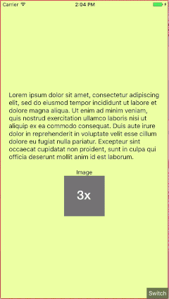

# react-native-device-screen-switcher

Testing your React Native UI layouts on different screen sizes can be quite time-consumning.

This library aims to make this much easier by allowing the run-time switching of the main app viewport to match the sizes of different devices.

> This library requires React Native 0.44.0-rc0 or above



# Usage

```
# When released to NPM
npm i -S react-native-device-screen-switcher
# In the meantime
npm i -S https://github.com/calvium/react-native-device-screen-switcher.git
```

In your root-level component, wrap the root component returned by `render()` with `<ScreenSwitcher>`.

```js
import ScreenSwitcher from 'react-native-device-screen-switcher';

class MyRoot extends Component {
 ...
 render() {
   return (<ScreenSwitcher>
         <MyRootComponent/>
    </ScreenSwitcher>)
 }
```

- Run your app in Debug mode. For best results run on the iPhone 6 Plus simulator:

```bash
react-native run-ios --simulator="iPhone 6 Plus"
```

- You'll see a 'Switch' button at the bottom-right of the screen.
- Tap this button to bring up a menu of the available screen sizes.
- Make your selection.

> The viewport is resized to the correct size.

Additionally, the app will render images using the density appropriate to the simulated device (@3x on iPhone 6 Plus, @2x on most others).

- Notes: Dimensions.get('window') will now return the size of the simulated device. So long as you have followed React Native's documentation and **not** cached these values, your app will continue to render with the correct simulated sizes.


To hide the `Switch` button use the `hideButton` prop on ScreenSwitcher, e.g.

```js
<ScreenSwitcher hideButton>
 ...
</ScreenSwitcher>
 }
```

# Similar libraries

This library was inspired by https://github.com/machadogj/react-native-layout-tester, which performs a similar function by running your app on an iPad.

However, that library required that you did not use React Native's `Dimensions` system, but used their own alternative system. It also required you to set your iPhone app to be Universal in Xcode. Neither of these are the case here.
